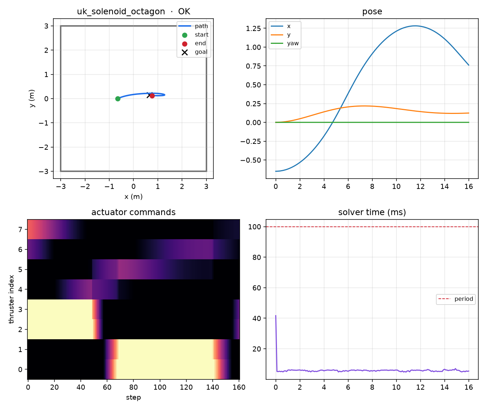
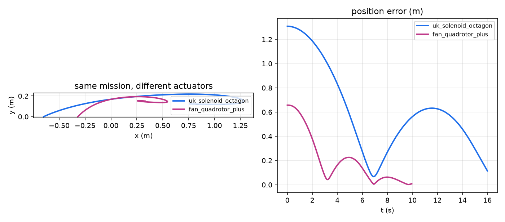

# airbearing

Planar (x, y, yaw) GNC for cubesats on air-bearing tables. You describe **your** vehicle in one JSON file.

This is laboratory / teaching software. **It is not flight software.** SI units everywhere.

Instructors: [docs/INSTRUCTOR.md](docs/INSTRUCTOR.md) (one-page TA/PI brief, ~20 min; print [docs/instructor.pdf](docs/instructor.pdf)).




## Install

Python **3.11+**.

```bash
git clone https://github.com/AevarOfjord/airbearing-testbed-mpc.git
cd airbearing-testbed-mpc
python3 -m venv .venv && source .venv/bin/activate   # Windows: .venv\Scripts\activate
pip install -e ".[dev,viz]"
# or: make install
airbearing --help          # same as: python -m airbearing
make test
```

## 60-second start

```bash
airbearing run --vehicle examples/vehicles/fan_plus.json
airbearing report runs/<id>
airbearing check examples/vehicles/fan_plus.json
airbearing compare --sim examples/logs/sim.csv --real examples/logs/hardware.csv
```

`runs/<id>/` contains `log.csv`, `summary.json`, a methods-style `methods.txt`, and plots.

## Model a vehicle (no Python edits)

**Visual builder** (top-down table):

```bash
airbearing edit-vehicle
# or: make edit-vehicle
```

Click to add/move/delete thrusters. Set type (`solenoid` / `pwm_fan` / `continuous`), `F_max`, bidirectional, direction, mass, \(I_z\), COM, table size. The HUD shows live ±Fx ±Fy ±Mz and **warns if plus-frame fans are radial (Mz ≡ 0)**. **Save writes JSON only under `vehicles/`** (created if missing).

Then:

```bash
airbearing check vehicles/mine.json --png docs/assets/mine.png
airbearing run --vehicle vehicles/mine.json --controller mpc
```

CLI wizard (also JSON only):

```bash
airbearing new-vehicle --noninteractive --name my_fans --n 4 --type pwm_fan --bidirectional --out vehicles/my_fans.json
```

Actuator types:

- `binary_solenoid` — on/off valves. Allocator uses a `[0,1]` relaxation; apply as PWM duty or `--round-binary`.
- `pwm_fan` — computer fans, duty `0..1` or bidirectional `[-1,1]`, first-order spin-up `tau`.
- `continuous` — ideal ±F_max (sim / offboard ESC).

Shipped **examples** (copy, then calibrate):

| File | What |
|------|------|
| `examples/vehicles/solenoid_octagon.json` | 8 compressed-air solenoids, large table |
| `examples/vehicles/fan_plus.json` | 4-fan plus layout (typical student cubesat); sim passthrough nav |
| `examples/vehicles/fan_plus_fused.json` | same fans, EKF fused sim mocap + IMU |
| `examples/vehicles/fan_hex.json` | 6 PWM fans + optional sim-only reaction wheel |
| `examples/vehicles/micro_3thruster.json` | 3 binary jets (allocator is not stuck at 8; controllability should warn) |

Your own files belong in `vehicles/`. Numbers in examples are **starting guesses**. Calibrate `F_max` on a scale ([docs/LAB.md](docs/LAB.md)).

## Campaign, report, identify, compare

```bash
airbearing run --vehicle vehicles/mine.json --controller mpc
airbearing report runs/<id>                 # settling, ∫|u|, solver p50/p95, misses, hashes

# PE: F_max scale + optional 0–2 step delay; residual plot
airbearing identify runs/<id>/log.csv --vehicle vehicles/mine.json \
  --out vehicles/mine_identified.json --residual vehicles/mine_residual.png

# Sim vs a hardware-shaped log (shipped; synthetic mocap noise — works offline)
airbearing compare --sim examples/logs/sim.csv --real examples/logs/hardware.csv
```

Open-loop ID logs: PRBS or chirp (`airbearing.identify.synthesize_excitation_log`), or reuse a closed-loop `log.csv`.

## Live twin, replay, dashboard

```bash
airbearing view --vehicle examples/vehicles/fan_plus.json
# arrows / WASD teleop, T teleop, M handover to MPC, space e-stop
airbearing run --replay labs/data/example_mocap.csv
airbearing run --dashboard --dashboard-port 8765
```

`--dashboard` is a stdlib HTTP page (`/`, `/status.json`, `POST /estop`). The e-stop flag zeros commands; it is not a substitute for a physical kill switch.

## Labs

| Lab | Command | Topic |
|-----|---------|--------|
| 1 | `make lab1` | editor + `check` |
| 2 | `make lab2` | PD vs LQR vs MPC (uses `airbearing report`) |
| 3 | `make lab3` | identify `F_max` from a log |
| 4 | `make lab4` | binary vs PWM vs `F_max` mismatch |
| 5 | `make lab5` | onboard vs mocap vs fused (sim sensors) |

Write-ups: [labs/README.md](labs/README.md).

## Hardware

```bash
airbearing run --vehicle vehicles/mine.json --armed --port /dev/ttyUSB0 --dashboard
```

`--armed` is required. Real mode **refuses invalid estimates** (null / timed-out mocap). Gateways implement a **~100 ms deadman**. IMU serial is a second port (`navigation.onboard.port`), not `--port`. See [docs/HARDWARE.md](docs/HARDWARE.md) and `firmware/`.

Pose source is selected in vehicle JSON (`navigation`): omit `onboard` for mocap-only, omit `external` for IMU-only, both to fuse. `estimator` is `passthrough` (copy pose) or `ekf`. Types: `sim`, `http_mocap`, `csv_replay`, `serial_imu`, `webcam_aruco`. Default if `navigation` is omitted: sim passthrough.

## Docs

- [docs/INSTRUCTOR.md](docs/INSTRUCTOR.md) — one-page TA/PI brief ([PDF](docs/instructor.pdf))
- [ARCHITECTURE.md](ARCHITECTURE.md) — one-pager
- [docs/YOUR_SATELLITE.md](docs/YOUR_SATELLITE.md) — JSON field guide
- [docs/MATH.md](docs/MATH.md) — 3-DOF, MPC, allocator
- [docs/HARDWARE.md](docs/HARDWARE.md) — fans, solenoids, firmware protocol
- [docs/LAB.md](docs/LAB.md) — scale calibration + system ID
- [labs/README.md](labs/README.md) — Lab 1–5

## Safety

Gateways implement a **~100 ms deadman** (no host packet → actuators 0). The Python supervisor never *adds* thrust. Keep the table clear; this kit will not save a runaway vehicle if you bypass `--armed`.
